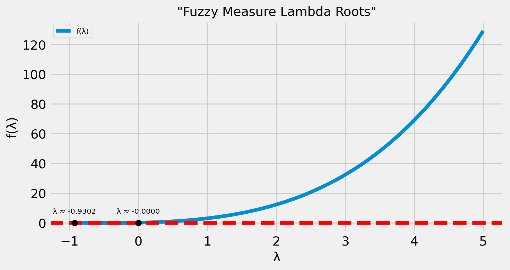

# 🔍 Fuzzy Measure Lambda Root Finder

This project numerically finds **all valid λ values** (lambda) that satisfy the nonlinear equation used in **Sugeno λ-measure** for fuzzy integrals:

\[
\lambda + 1 = \prod_{i=1}^{n} (1 + \lambda \cdot g_i)
\]

Where \( g_i \) are fuzzy measures (confidence levels) of sensors or information sources.

---

## 📌 What It Does

- Accepts a set of fuzzy measures (e.g. sensor weights)
- Constructs the nonlinear function based on Sugeno’s definition
- Scans a large interval of λ values and identifies all **sign changes** (where a root might exist)
- Uses the **bisection method** to accurately compute all valid λ values
- Plots the function for visual insight

---

## 📊 Example Plot



Shows where the function crosses zero (potential lambda roots).

---

## 💻 How to Use

### 1. Install dependencies

```bash
pip install numpy scipy matplotlib
```

### 2. Run the script

```bash
python Lambda.py
```

### 3. Output

The script will display all valid λ values like:

```
Valid lambda roots found:
λ ≈ 0.019547
λ ≈ 0.873210
λ ≈ 2.684552
λ ≈ 4.321881
```

---

## 🧠 How It Works

- The script evaluates the function over a range: `λ ∈ [-0.99, 5]`
- It finds sub-intervals where the function changes sign
- Uses `scipy.optimize.root_scalar()` with the **bisection method** to isolate each root
- Duplicates are filtered out for clean results

---